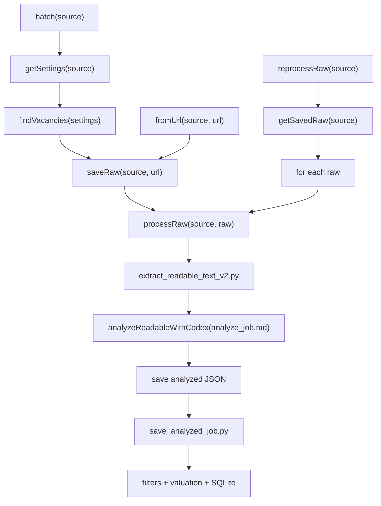

# JobSeeker Workflow

This file is the public contract for how JobSeeker is run.

API here means a callable entry point for Codex/scripts. It is not an HTTP
server yet.

## Execution Diagram

All public calls must reuse the same raw-processing branch.



Rules:

- `batch` and `fromUrl` may differ only before `saveRaw`.
- `reprocessRaw` starts from already saved raw files.
- After raw exists, every path must call the same `processRaw`.
- No public call may analyze a live URL directly.
- If we later turn this into real code/API, this diagram is the contract it must
  implement.

## Public Calls

### 1. batch(source)

Reads `collector/config/<source>.properties`, finds vacancy URLs, saves each
vacancy as raw HTML, then sends every saved raw file to `process_raw`.

Java-shaped flow:

```java
batch(source) {
    urls = findVacancies(sourceConfig);
    for (url : urls) {
        raw = saveRaw(source, url);
        processRaw(source, raw);
    }
}
```

### 2. fromUrl(source, url)

Used for debug and calibration. It saves exactly this vacancy as raw HTML, then
sends that saved raw file to `process_raw`.

Java-shaped flow:

```java
fromUrl(source, url) {
    raw = saveRaw(source, url);
    processRaw(source, raw);
}
```

For LinkedIn, `saveRaw` uses the logged-in browser page content. It must not use
direct Python HTTP.

### 3. reprocessRaw(source)

Does not search and does not download anything. It takes already saved raw HTML
files and sends them to `process_raw`.

Java-shaped flow:

```java
reprocessRaw(source) {
    raws = findSavedRawFiles(source);
    for (raw : raws) {
        processRaw(source, raw);
    }
}
```

## One Internal Process

All public calls converge here.

```java
processRaw(source, raw) {
    text = extractReadableTextV2(source, raw);
    json = analyzeReadableWithCodex(source, text, "analyzer/prompts/analyze_job.md");
    saveJson("data/analyzed/<source>/", json);
    run("python analyzer/save_analyzed_job.py --input <json> --source <source>");
}
```

`process_raw` must not care where raw came from: search, direct URL, or saved
files. This is the main rule that keeps calibration honest.

## Boundaries

- Collectors collect and save raw pages.
- `analyzer/extract_readable_text_v2.py` converts raw HTML into readable text.
- Analyzer prompt extracts structured JSON from readable text.
- `analyzer/save_analyzed_job.py` reads analyzed JSON, applies filters,
  calculates valuation, and writes SQLite.
- Direct user links go through `fromUrl`; they are not analyzed live.
- No Python string heuristics for job meaning unless we explicitly decide to add
  them later.
