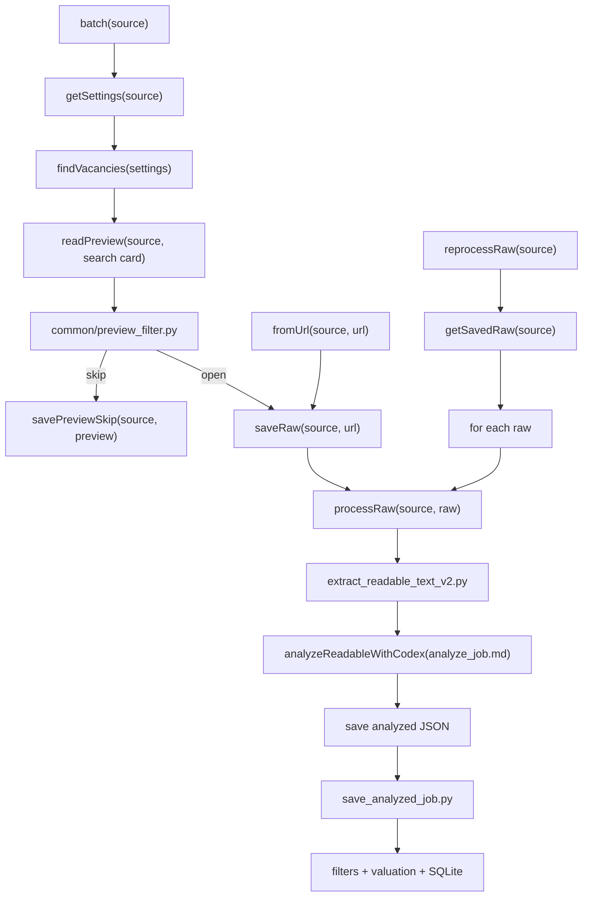

# JobSeeker Workflow

This file is the public contract for how JobSeeker is run.

API here means a callable entry point for Codex and/or scripts. It is not an
HTTP server yet.

Current execution model:

- Public calls like `batch linkedin`, `from-url linkedin <url>`, and
  `reprocess-raw linkedin` are commands to Codex.
- Some steps are scripts.
- Some steps are Codex-agent steps.
- A Codex-agent step is still part of the workflow contract. Codex must execute
  it instead of stopping just because there is no Python module for that step.

## Execution Diagram

All public calls must reuse the same raw-processing branch.



Rules:

- `batch` and `fromUrl` may differ only before `saveRaw`.
- `batch` may use preview data from search result cards to skip obvious misses
  before opening full vacancy pages.
- If search settings define ordered locations and a global limit, `batch` must
  process locations in order and continue within the current location until the
  limit is reached or that location is exhausted. It must not sample a small
  fixed percentage from every location unless a separate balancing mode is
  explicitly configured.
- `reprocessRaw` starts from already saved raw files.
- After raw exists, every path must call the same `processRaw`.
- No public call may analyze a live URL directly.
- If a public call includes `processRaw`, Codex must continue through readable
  extraction, agent analysis, JSON save, and SQLite save unless the user
  explicitly asks to stop earlier.
- If we later turn this into real code/API, this diagram is the contract it must
  implement.

## Public Calls

### 1. batch(source)

Reads `collector/config/<source>.properties`, finds vacancy URLs, saves each
vacancy as raw HTML, then sends every saved raw file to `process_raw`.

Java-shaped flow:

```java
batch(source) {
    urls = findVacancies(sourceConfig);
    for (card : searchResultCards) {
        preview = readPreview(source, card);
        decision = runPreviewFilter(preview);
        if (decision == "skip") {
            savePreviewSkip(preview);
            continue;
        }
        raw = saveRaw(source, preview.sourceUrl);
        processRaw(source, raw);
    }
}
```

For LinkedIn, `findVacancies` must collect every loaded card from the current
search-results page, including cards that require scrolling inside the results
panel. Opening `start=0`, `start=25`, and so on is not enough by itself; each
page must be exhausted before moving to the next `start`.

### 2. fromUrl(source, url)

Used for debug and calibration. It saves exactly this vacancy as raw HTML, then
sends that saved raw file to `process_raw`.

Java-shaped flow:

```java
fromUrl(source, url) {
    raw = saveRaw(source, url);
    processRaw(source, raw);
}
```

For LinkedIn, `saveRaw` uses the logged-in browser page content. It must not use
direct Python HTTP.

### 3. reprocessRaw(source)

Does not search and does not download anything. It takes already saved raw HTML
files and sends them to `process_raw`.

Java-shaped flow:

```java
reprocessRaw(source) {
    raws = findSavedRawFiles(source);
    for (raw : raws) {
        processRaw(source, raw);
    }
}
```

## One Internal Process

All public calls converge here.

```java
processRaw(source, raw) {
    text = extractReadableTextV2(source, raw);                  // script
    json = CodexAgent.analyze(
        source,
        text,
        "analyzer/prompts/analyze_job.md"
    );                                                          // agent step
    saveJson("data/analyzed/<source>/", json);                  // file write
    run("python analyzer/save_analyzed_job.py --input <json> --source <source>");
}
```

`process_raw` must not care where raw came from: search, direct URL, or saved
files. This is the main rule that keeps calibration honest.

Important: `CodexAgent.analyze(...)` is intentionally not a Python script at the
current stage. It means Codex reads the saved readable text, applies
`analyzer/prompts/analyze_job.md`, writes one analyzed JSON file, and then calls
the SQLite saver.

## Boundaries

- Collectors collect and save raw pages.
- Preview extraction reads visible search-card text only.
- `common/preview_filter.py` may skip obvious misses before raw download.
- `analyzer/extract_readable_text_v2.py` converts raw HTML into readable text.
- Codex-agent analysis with `analyzer/prompts/analyze_job.md` extracts
  structured JSON from readable text.
- `analyzer/save_analyzed_job.py` reads analyzed JSON, applies filters,
  calculates valuation, and writes SQLite.
- Direct user links go through `fromUrl`; they are not analyzed live.
- No Python string heuristics for job meaning unless we explicitly decide to add
  them later.
